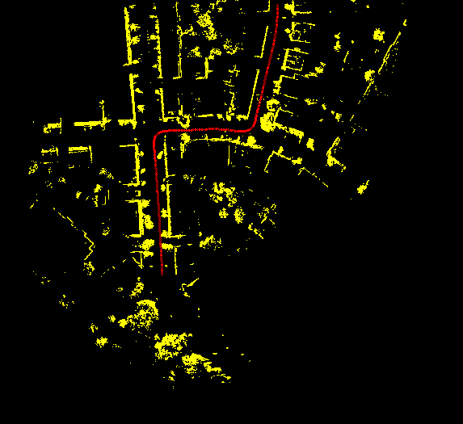

# Pointnet based lidar odometry prediction in 2D space

### Odometry prediction with KITTI Lidar dataset

  
  

This work implements the following steps
1. Extract lidar scans
2. Convert to depth image with spherical projection
3. KD-Tree based depth completion
4. Find feature matches with ORB features
5. Reproject back to euclidean space 
3. PointNet based architecture for realtime odometry prediction

### Results

  
  

Graph in the left shows the odometry prediction of the point-based model relative to ground truth in KITTI city 0. The graph in the right shows the performance for ICP for the same city. 

