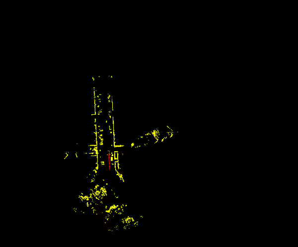
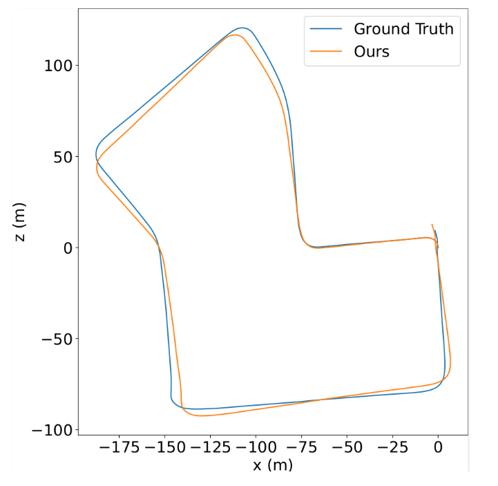
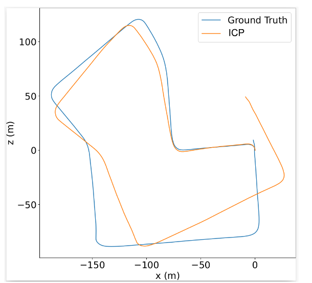

# Pointnet based lidar odometry prediction in 2D space

### Odometry prediction with KITTI Lidar dataset

This work implements the following steps
1. Extract lidar scans
2. Convert to depth image with spherical projection
3. KD-Tree based depth completion
4. Find feature matches with ORB features
5. Reproject back to euclidean space 
3. PointNet based architecture for realtime odometry prediction

### Results

  
  

Graph in the left shows the performance of the model in comparison with ground truth in city 0, while the graph in the right shows the performance for ICP in the same city.

### Reference
1. LodoNet: A Deep Neural Network with 2D Keypoint Matchingfor 3D LiDAR Odometry Estimation
